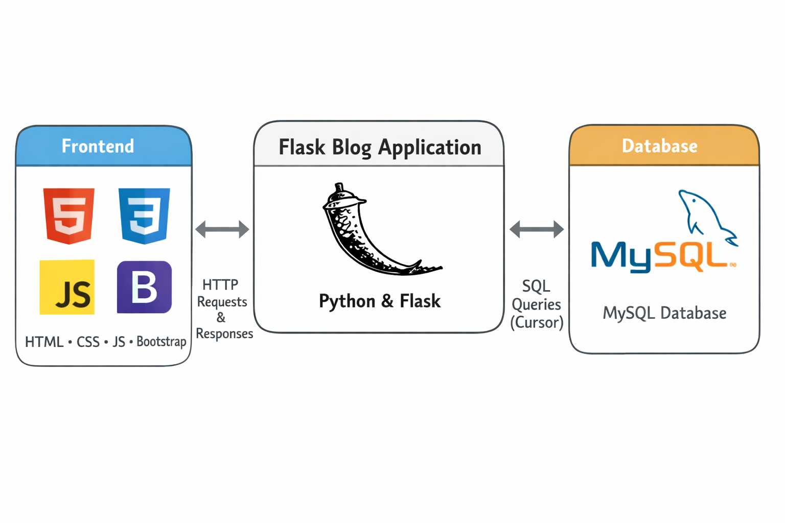

# Flask Blog Application

Bu proje, Flask kullanılarak geliştirilmiş ve MySQL veritabanı ile çalışan bir blog uygulamasıdır.
Kullanıcı yönetimi, blog yazıları ve iletişim formu gibi temel özellikleri içerir.
Veritabanı ve mail yapılandırmaları güvenlik amacıyla environment variable üzerinden yönetilmektedir.

## Mimari
Uygulama; HTTP isteklerinin Flask route’lar tarafından karşılanması, iş mantığının çalıştırılması,
MySQL veritabanı ile veri etkileşimi ve Jinja2 template’leri üzerinden HTML çıktısı üretilmesi
şeklinde bir akışa sahiptir. Geliştirme ve canlı ortam ayarları birbirinden ayrıdır ve hassas
bilgiler doğrudan kod içinde tutulmaz.

## 🔗 PROJENİN CANLI HALİ

PROJENİN CANLI HALİNİ GÖRMEK İÇİN AŞAĞIDAKİ BAĞLANTIYI ZİYARET EDEBİLİRSİNİZ.

 

<a href="https://flaskblog.pythonanywhere.com/" target="_blank">
    👉 Live Demo – Flask Blog
</a>

## Gereksinimler
Python 3.x  
Flask  
MySQL  

## Kurulum
Projenin çalıştırılabilmesi için öncelikle depo klonlanır ve proje dizinine girilir.
Python sanal ortamı oluşturularak aktif edilir ve gerekli bağımlılıklar yüklenir.

Veritabanı tarafında MySQL üzerinde boş bir veritabanı oluşturulması beklenmektedir.
Oluşturulan veritabanı adı, aşağıda belirtilen environment variable içinde kullanılmalıdır.

Uygulamanın çalışması için gerekli environment variable’lar aşağıdaki gibidir:

SECRET_KEY=your_secret_key  
MYSQL_HOST=localhost  
MYSQL_USER=root  
MYSQL_PASSWORD=******  
MYSQL_DB=blog  
MYSQL_PORT=3306  
MAIL_FROM=  
MAIL_TO=  
MAIL_USER=  
MAIL_PASSWORD=  

Tüm değişkenler tanımlandıktan sonra uygulama Flask üzerinden çalıştırılabilir.

## Not
Bu projede DEBUG modu canlı ortam için kapalı olacak şekilde tasarlanmıştır.
Hassas bilgiler (veritabanı bilgileri, mail hesapları ve secret key) kaynak koda eklenmemiştir.
Bu yaklaşım, projenin GitHub üzerinde güvenli şekilde paylaşılmasını ve farklı ortamlara
kolayca deploy edilebilmesini amaçlamaktadır.
